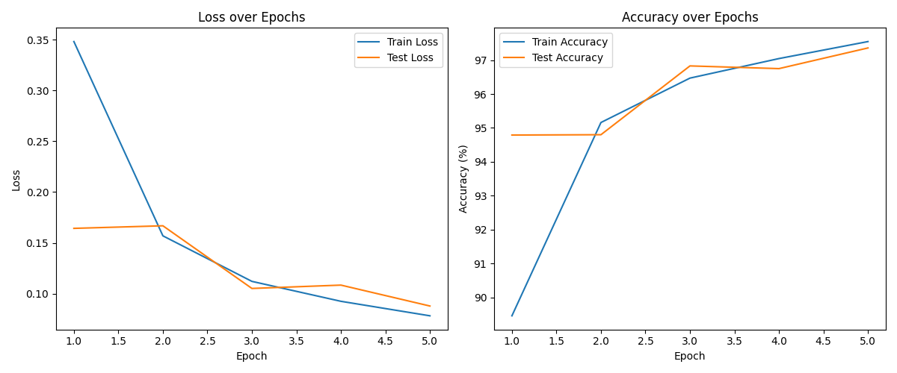
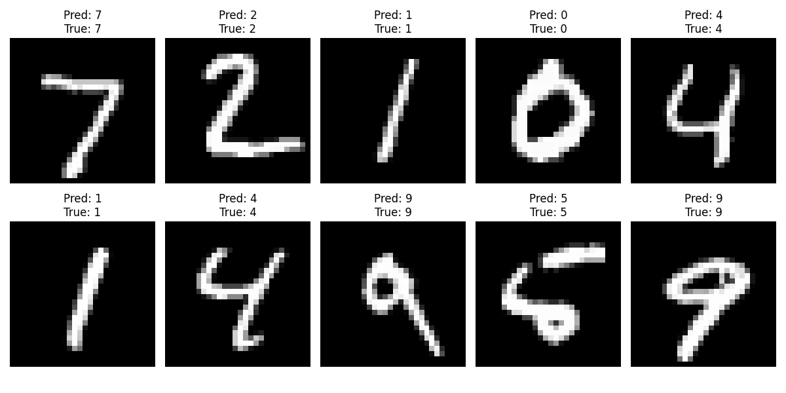

## MNIST CLASSIFICATION USING MULTI-LAYER PERCEPTRON

This implementation uses PyTorch to build, train, and evaluate a multilayer perceptron (MLP) for classifying handwritten digits from the MNIST dataset.

### TOOLS & LIBRARIES
- **Python**
- **PyTorch** (including `torchvision` for dataset handling)
- **Matplotlib** for visualization
- **NumPy**

### DATA PREPARATION
- **Dataset**: MNIST with 60,000 training and 10,000 test images.
- **Transformations**: Images are converted to tensors and normalized.
- **DataLoader**: Used to batch and shuffle the data.

### MODEL ARCHITECTURE
- **Input Layer**: 784 neurons (28×28 flattened image).
- **Hidden Layers**:
  - First hidden layer: 256 neurons with ReLU activation.
  - Second hidden layer: 128 neurons with ReLU activation.
- **Output Layer**: 10 neurons (one for each digit class).
- **Flattening**: Converts 2D images into 1D vectors before passing to the network.

### TRAINING SETUP
- **Loss Function**: Cross-Entropy Loss.
- **Optimizer**: Adam with a learning rate of 0.001.
- **Batch Size**: 64.
- **Epochs**: 5.
- **Device**: GPU if available, otherwise CPU.

### TRAINING PROCESS
- **Forward Pass**: Input images are flattened and passed through the network.
- **Backward Pass**: Loss is computed and gradients are propagated using backpropagation.
- **Metrics**: Training and test losses and accuracies are recorded each epoch.
- **Verbose Logging**: Loss values are printed periodically during training.

### VISUALIZATIONS
- **Loss & Accuracy Trends**: Plots show how training and test losses, as well as accuracies, change over epochs.
  - 
- **Sample Predictions**:
  - 

### MODEL EVALUATION
The final training and testing loss comes out to be 0.753 and 0.0879 respectively with a testing accuracy of 97.27%.