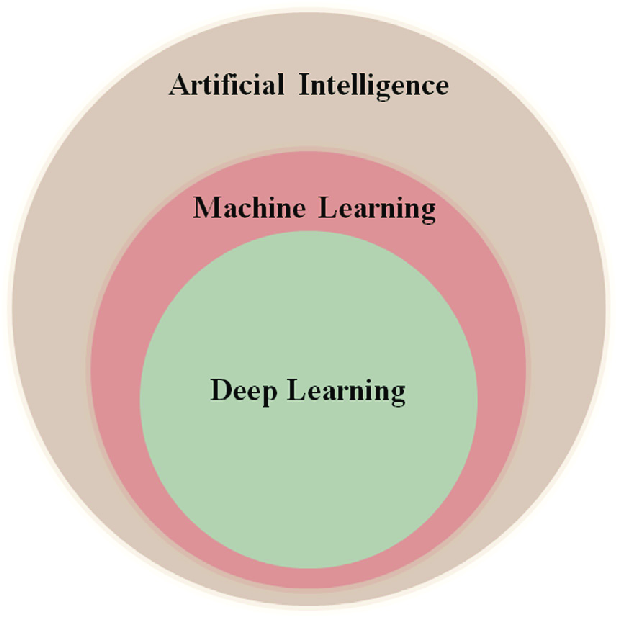

# MACHINE LEARNING AND ARTIFICIAL INTELLIGENCE

<table>
  <tr>
    <td style="width: 40%; vertical-align: top; text-align: center;">
      
      
<em>Fig: Venn diagram depicting AI, ML, and DL hierarchy.</em>

    </td>
    <td style="width: 60%; vertical-align: top;">
      - <strong>Artificial Intelligence (AI):</strong> The field of computer science focused on creating systems that can perform tasks requiring human-like intelligence, such as problem-solving, reasoning, perception, and decision-making.
        
      - <strong>Machine Learning (ML):</strong> A subset of AI that enables computers to learn from data and improve their performance on a task without being explicitly programmed. It involves algorithms that identify patterns and make predictions or decisions based on input data.
        
      - <strong>Deep Learning (DL):</strong> A subset of ML that uses artificial neural networks with multiple layers to analyze complex patterns in large datasets. It is particularly effective in tasks like image recognition, natural language processing, and speech recognition.
    </td>
  </tr>
</table>

#### Examples of AI applications:
- Using statistical algorithms like linear regression to predict a certain quantity.
- Self-driving cars -> Uses various techniques including image recognition models (like Convolutional Neural Networks) to detect obstacles.
- Large Language Models: <a href="https://chatgpt.com">ChatGPT (by OpenAI)</a>, <a href="https://gemini.google.com">Gemini (by Google)</a>
- <a href="https://zoo.dev/text-to-cad">Text to CAD model (Zoo.dev)</a>

## Classification of learning algorithms:
There are mainly 3 types:  
1. **Supervised learning:** Models are trained on labeled data, where both input and output are known. The algorithm learns to map inputs to the correct outputs.  
*Example*: Predicting house prices based on features like size, location, and number of bedrooms, where the training dataset includes the actual prices.
2. **Unsupervised learning:** Models are trained on unlabeled data and must find patterns and structures on its own, such as grouping similar items.  
*Example*: Grouping customers based on purchasing behavior without knowing beforehand what the customer segments should look like.
3. **Reinforcement learning:** Models learn through trial and error by interacting with an environment, receiving feedback in the form of rewards or penalties, and adjusting actions to maximize long-term rewards.  
*Example*: A game-playing AI like AlphaGo, which learns by playing numerous games and adjusting its strategy based on the outcomes (wins/losses).

**Example algorithms of each type:**  
1. **Supervised Learning:** Linear regression, logistic regression, decision trees, random forests, Multi-layer perceptron
2. **Unsupervised Learning:** K-means clusturing, hierarchical clustering, Principal Component Analysis (PCA).
3. **Reinforcement Learning:** Q-Learning, Deep Q-Networks (DQN), Monte Carlo Tree Search (MCTS)

## Workflow of a Machine Learning Project
1. **Define the problem**  
Defining the objectives, the type of problem (regression, classification, clustering, etc.), the tool required to solve it and so on.
2. **Data Collection**  
Collect data using various sources like databases, APIs or by other means.
3. **Data Preprocessing**  
- Data cleaning: Handling missing values, removing duplicates, etc.
- Data transformation: Normalization, standardization, etc.
- Featur engineering: Creating new features, encoding categorical variables.
- Data splitting: Splitting the data into training, validation and testing.
4. **Exploratory Data Analysis (EDA)**  
Visualize the data using graphs, pie charts, etc.
5. **Model Selection**  
Selecting the appropriate model (Linear Regression, Random forests or deep learning techniques like CNN).
6. **Model Training**  
Selecting loss function (Mean Absolute Error, Cross-entropy loss, etc.), hyperparameter tuning, and training the model.
7. **Model Evaluation**  
Using accuracy metrics (like R-sqaured) to evaluate the trained model.
8. **Model Optimization**  
Use techniques like L2 regularization, dropout layers, etc. to reduce overfitting, etc.
9. **Deploy and maintain the model**  

### Reference
1. Artificial intelligence for cardiovascular disease risk assessment in personalised framework: a scoping review - Scientific Figure on ResearchGate. Available from: https://www.researchgate.net/figure/enn-diagram-depicting-AI-ML-and-DL-hierarchy_fig2_381250953 [accessed 6 Feb 2025]
2. <a href="https://www.kaggle.com/datasets/himanshunakrani/iris-dataset">Iris dataset</a>

### Resources for further reading
1. <a href="https://mml-book.github.io/book/mml-book.pdf">Mathematics for Machine Learning</a>
2. <a href="https://themlbook.com/">The Hundred Page Machine Learning Book</a>
3. <a href="https://www.coursera.org/specializations/machine-learning-introduction">Machine Learning Specialization</a>
